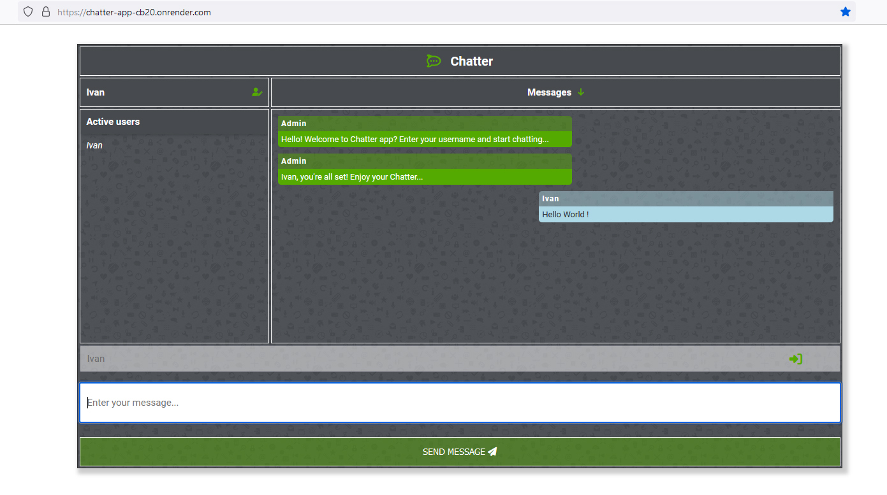

# Chatter-app
 

### Real time chat application hosted on render.com

 
<a href="https://chatter-app-cb20.onrender.com/">Live demo</a>
 
 

 

#### Brief description

Real time chat app, built around Node.js server with Socket.io library for handling client/server communication.

App can register user connections, disconnections, username edit and communication between all clients

List of active users is displayed in the left part of the app screen and updated according to connections
